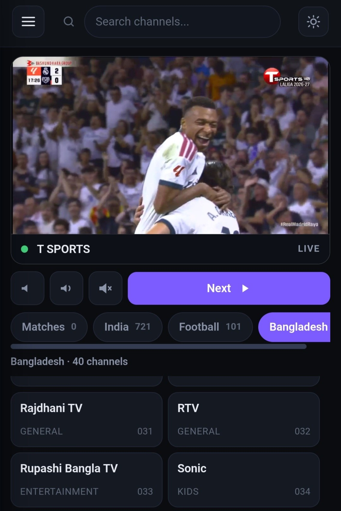

<div align="center">

# 📺 Torongo

[](https://developer.mozilla.org/en-US/docs/Web/HTML)
[](https://developer.mozilla.org/en-US/docs/Web/CSS)
[](https://developer.mozilla.org/en-US/docs/Web/JavaScript)
[](https://github.com/video-dev/hls.js)
[](LICENSE)

*A Live TV Andoid App(See Releases) and IPTV player that runs entirely in your browser — no backend, no build step, no install.*

### 🎬 [**Install Torongo in your Mobile →**](https://github.com/arafat01rahman/torongo-live-tv/releases/tag/v1.1)
<sub>Four files. Zero dependencies. Works offline once loaded.</sub>

</div>

Torongo turns any M3U playlist into a browsable, searchable TV guide with an embedded HLS player. It fetches public streams, parses them client-side, groups channels by category, and plays them through **hls.js** or the browser's native HLS engine.

<div align="center">
  
</div>

---

## 🔍 Overview

Torongo is a single-page IPTV player built on plain web technologies:

- **Parser (JS):** reads M3U / M3U8 text, handles quoted attributes, `#EXTGRP`, `#EXTVLCOPT`, and CRLF line endings.
- **Player:** `hls.js` for browsers without native HLS, native `.m3u8` playback on Safari and iOS.
- **Sources:** ships with [iptv-org](https://github.com/iptv-org/iptv) category and country playlists, regenerated daily upstream.
- **Runtime playlists:** users add their own M3U URLs through a built-in dialog — no code editing required.
- **Scanner:** probes every channel of the active source in parallel and flags unreachable links.

> No framework. No bundler. No server. Clone the folder and open it.

---

## ✨ Features

- 📺 **HLS playback** via hls.js or native browser support
- 🗂️ **Category grouping** — channels rendered in collapsible sections per `group-title`
- ➕ **Runtime playlist management** — add, name, and remove M3U sources from the UI
- 🔍 **Cross-source search** — one query sweeps every configured playlist in parallel
- 🩺 **Stream scanner** — flags dead links in the current tab, updates live during playback
- 🎨 **Light and dark schemes** — follows system preference, user choice persisted
- 📱 **Responsive layout** — sidebar collapses into an off-canvas drawer on mobile
- ⌨️ **Keyboard shortcuts** — `↓` / `Space` for next, `Esc` to dismiss overlays
- 🚫 **No dependencies** — one CDN script (`hls.js`), nothing else

---

## 🏗️ Architecture
```

Browser (index.html)
│  fetch(playlist.m3u)
▼
channels.js — source definitions
│
▼
app.js — parser → grouping → render → search → scan
│
▼
<video> via hls.js  OR  native HLS

````text
Everything runs in the page. There is no server component and no API to stand up.

---

## 🛠️ Tech Stack

| Layer         | Tech                                            |
|---------------|-------------------------------------------------|
| Markup        | HTML5, semantic structure, inline theme bootstrap |
| Styling       | CSS3 — custom properties, `aspect-ratio`, grid  |
| Logic         | Vanilla JavaScript (ES2020, IIFE, no modules)   |
| Playback      | hls.js 1.5, Media Source Extensions, native HLS |
| Persistence   | `localStorage` for custom sources and theme     |
| Sources       | iptv-org public playlists                       |

---

## 🚀 Getting Started

Clone or download the four project files into a folder:

```bash
git clone https://github.com/<you>/torongo.git
cd torongo
````

### 1. Serve the folder

```bash
python3 -m http.server 8000
```

Open `http://localhost:8000`.

> Opening `index.html` directly via `file://` works in most browsers, but some block `fetch()` on local files. A local HTTP server avoids the issue entirely.

### 2. Pick a channel

Click any tab on the left, then click a channel. Search sweeps every source at once.

### 3. Add your own playlist

Click **Add M3U** in the sidebar footer, paste a playlist URL, and it appears as a new tab.

---

## 📁 Project Structure

```text
.
├── index.html      # Markup + inline theme bootstrap
├── style.css       # Layout and colour tokens
├── channels.js     # Source definitions and tunables
└── app.js          # Parser, search, scanner, player
```

| File | Responsibility |
| --- | --- |
| `index.html` | Markup, meta tags, and the inline script that applies the theme on paint. |
| `style.css` | All layout and colour. Two token blocks — dark and light — nothing else. |
| `channels.js` | Playlist URLs, tab order, and constants. The only file to edit for new permanent sources. |
| `app.js` | M3U parser, cross-source search, dead-link scanner, HLS player, UI wiring. |

---

## ⚙️ Configuration

All tunables live in `channels.js`.

| Constant | Default | Description |
| --- | --- | --- |
| `DEFAULT_SOURCE` | `"all"` | Source loaded on startup. |
| `PLAYLIST_TIMEOUT_MS` | `20000` | Playlist fetch timeout (ms). |
| `SEARCH_ALL_TABS` | `true` | Whether search queries every source. |
| `SEARCH_RESULT_LIMIT` | `250` | Max rows rendered for one search. |
| `SCAN_CONCURRENCY` | `12` | Parallel probes during a scan. |
| `SCAN_TIMEOUT_MS` | `3000` | Per-stream probe timeout (ms). |

### Adding a permanent source

Edit `CHANNEL_SOURCES` in `channels.js`:

```js
mySource: {
    label: "My Source",
    url: "https://example.com/playlist.m3u",
    limit: 300,              // 0 for unlimited
    onlySports: false,       // keep only groups matching /sport/
    match: ["espn", "bein"]  // optional keyword whitelist
}
```

Add the key to `SOURCE_ORDER` to control the tab position. Unlisted keys append at the end.

---

## 🩺 Stream Scanning

Browsers cannot read HTTP status codes from cross-origin responses, so a server-side `HEAD` check is not possible without a backend. Torongo issues a `fetch(url, { mode: "no-cors" })` probe per channel instead:

- **Resolved** — DNS succeeded, connection opened, server responded. Marked alive.
- **Rejected or timed out** — after 3 s the request is aborted. Marked dead and dimmed in the list.

Channels that fail during playback (hls.js emits a fatal error) are added to the same set automatically, so the list self-heals as you browse.

### Offline pre-filtering

For a frozen, verified playlist, run a Python filter once and host the output:

```python
import concurrent.futures
import urllib.request

def check(item):
    name, url = item
    try:
        req = urllib.request.Request(url, headers={"User-Agent": "Mozilla/5.0"}, method="HEAD")
        with urllib.request.urlopen(req, timeout=2.5) as r:
            return (name, url) if r.status == 200 else None
    except Exception:
        return None

with concurrent.futures.ThreadPoolExecutor(max_workers=30) as ex:
    alive = [r for r in ex.map(check, raw_channels) if r]

with open("playlist.m3u", "w", encoding="utf-8") as f:
    f.write("#EXTM3U\n")
    for name, url in alive:
        f.write(f"#EXTINF:-1,{name}\n{url}\n")
```

Upload `playlist.m3u` to GitHub Pages, a Gist, or any static host, then paste its URL into **Add M3U**.

---

## 🌐 Playlist Sources

Default tabs point at [iptv-org](https://github.com/iptv-org/iptv), which regenerates its playlists daily:

```text
https://iptv-org.github.io/iptv/categories/<category>.m3u
https://iptv-org.github.io/iptv/countries/<cc>.m3u
https://iptv-org.github.io/iptv/index.m3u
```

Torongo does not host, proxy, or re-stream any content. All streams are public links aggregated by third parties. Availability and geoblocking are controlled entirely by the upstream providers.

---

## 🔧 Browser Support

| Browser | Playback engine |
| --- | --- |
| Chrome, Edge, Firefox | hls.js |
| Safari (macOS, iOS) | Native HLS |
| Browsers without MSE | Error message |

Requires `fetch`, `AbortController`, `localStorage`, and CSS `aspect-ratio` — all baseline since 2021.

---

## ⌨️ Keyboard Shortcuts

| Key | Action |
| --- | --- |
| `↓` / `Space` | Next channel |
| `Esc` | Close Add M3U dialog / drawer |

---

## 🧱 Design Notes

- **No frameworks, no bundler, no build step.** Edit a file, refresh.
- **No `backdrop-filter`, `color-mix`, or animated gradients.** The UI stays smooth on low-end phones.
- **No CSS transitions on the video element or the channel list.** List swaps never animate.
- **`content-visibility: auto`** on list rows so off-screen items don't cost layout.
- **Grouped and capped rendering** — the full list stays in memory for search, but the DOM only ever holds a screenful.
- **Identity-based active-channel marker**, not index-based, so reordering during a search doesn't lose the highlight.

---

## 🤝 Contributing

Issues and pull requests welcome. Please keep changes focused and avoid introducing build tooling or runtime dependencies.

Before submitting a change, verify it works in both colour schemes and at a 360 px viewport width.

---

## 📜 License

MIT

---

## 🙏 Acknowledgements

- [iptv-org](https://github.com/iptv-org) — the public playlist project Torongo depends on.
- [hls.js](https://github.com/video-dev/hls.js) — the sole runtime dependency.
- Every maintainer of a public stream that actually stays up.

```text

